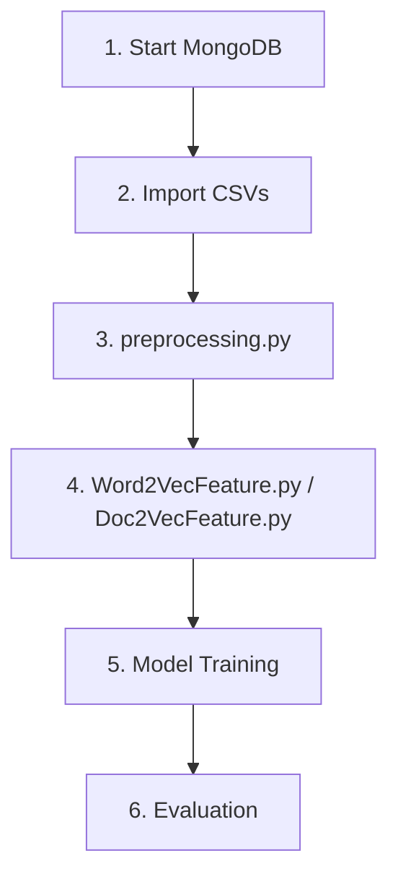

# AGENTS.md - AI Agent Guidelines

## Project Summary

**Agile User Story Point Estimation** is a machine learning research project that predicts story points from user story text using NLP embeddings and regression models.

| Aspect         | Details                                                               |
| -------------- | --------------------------------------------------------------------- |
| **Input**      | User story text (title + description)                                 |
| **Output**     | Story point estimate (numeric)                                        |
| **Dataset**    | 23,313 issues from 16 open-source projects                            |
| **Tech Stack** | Python 3.13, TensorFlow 2.20, scikit-learn, LightGBM, CatBoost, Gensim |

---

## Repository Structure

```text
├── preprocessing.py        # Data preprocessing and TF-IDF vectorization
├── helper.py               # split_data() - project-stratified splitting
├── prepareData.py          # LSTM data preparation
├── mongodbConnector.py     # MongoDB data access
├── Word2VecFeature.py      # Word2Vec feature extraction
├── Doc2VecFeature.py       # Doc2Vec feature extraction
├── RandomForest.py         # Random Forest regressor
├── lightGBM.py             # LightGBM regressor
├── catb.py                 # CatBoost regressor
├── LSTM_regression.py      # End-to-end LSTM model
├── data_csv/               # Preprocessed data
├── dataset/                # Raw CSV files for MongoDB import
├── features/               # Generated embeddings
├── helper/                 # Pickled artifacts
├── models/                 # Trained models
├── docs/                   # Generated documentation and reports
├── docker-compose.yml      # Docker services (app + MongoDB)
├── Dockerfile              # Python 3.9 environment
├── pyproject.toml          # Modern dependency management (uv/pip compatible)
├── .python-version         # Python 3.9 version constraint
├── netskope-env.sh         # Certificate configuration for corporate networks
└── requirements.txt        # Legacy pinned dependencies
```

---

## Critical Rules

### 🔴 MUST Follow

1. **Use project-stratified splits**

   ```python
   from helper import split_data
   x_train, x_test, y_train, y_test = split_data(x, y, ratio=0.2)
   ```

   **NEVER** use `sklearn.model_selection.train_test_split` directly.

2. **Run preprocessing first**

   ```bash
   # Option 1: Using uv-managed venv with Netskope certificates (recommended)
   source ./netskope-env.sh && .venv/bin/python preprocessing.py
   
   # Option 2: Using Docker
   docker compose exec app python preprocessing.py
   ```

   This creates required artifacts in `helper/` before any feature extraction.

3. **Exclude 'project' column from training**

   ```python
   model.fit(x_train.iloc[:, :-1], y_train)  # Last column is 'project'
   ```

4. **Report all three metrics**: MAE, MdAE, MSE

5. **Use modern dependency management**

   ```bash
   # Setup environment (handles Netskope certificates)
   source ./netskope-env.sh
   
   # Option 1: uv (modern, faster - partial support due to certificate issues)
   uv sync --native-tls  # May fail with certificate errors
   
   # Option 2: pip3 in uv venv (recommended fallback)
   .venv/bin/pip3 install package_name
   
   # Option 3: Docker (most reliable)
   docker compose up -d --build
   docker compose exec app python <script.py>
   ```

### 🟡 Should Follow

- Use `--proc` as even number for multiprocessing
- Delete `models/` folder to retrain from scratch
- Use Word2Vec/Doc2Vec features with CatBoost (not TF-IDF)
- **Configure Netskope certificates** for corporate networks: `source ./netskope-env.sh`
- **Prefer pip3 over uv** for dependency installation until certificate issues resolved

### 🟢 Conventions

- Text concatenation: `title + ". " + description`
- Feature file naming: `features/{feature_name}_{size}.csv`
- Sparse matrices: `.npz` format (not pickle)

---

## Execution Order



### Docker Commands (Recommended)

```bash
# Setup
docker compose up -d --build
docker compose exec mongo mongo mydb --eval 'db.createCollection("storypoint")'
docker compose exec mongo bash -lc 'for f in /dataset/*.csv; do mongoimport -d mydb -c storypoint --type CSV --file "$f" --headerline; done'

# Run pipeline
docker compose exec app python preprocessing.py
docker compose exec app python Word2VecFeature.py --proc 8
docker compose exec app python RandomForest.py --size 100 --feature_name word2vec_ave
```

### Modern uv/pip Commands (Alternative)

```bash
# Setup certificates for corporate networks
source ./netskope-env.sh

# Install dependencies (fallback method)
.venv/bin/pip3 install -r requirements.txt

# Run pipeline
.venv/bin/python preprocessing.py
.venv/bin/python Word2VecFeature.py --proc 8
.venv/bin/python RandomForest.py --size 100 --feature_name word2vec_ave
```

---

## Code Patterns

### Adding a New Model

```python
#!/usr/bin/env python3
"""New regressor model template."""

import pandas as pd
import argparse
from sklearn.metrics import mean_absolute_error, median_absolute_error, mean_squared_error
from helper import split_data

# Parse arguments
parser = argparse.ArgumentParser()
parser.add_argument('--size', default='100', type=str, help='Embedding size')
parser.add_argument('--feature_name', default='word2vec_ave', type=str, help='Feature name')
args = parser.parse_args()

# Load data
x = pd.read_csv(f"features/{args.feature_name}_{args.size}.csv", index_col=0)
data_csv = pd.read_csv("data_csv/data")
y = data_csv.point

# Split (project-stratified)
x_train, x_test, y_train, y_test = split_data(x, y, ratio=0.2)

# Train (exclude 'project' column)
# model = YourRegressor()
# model.fit(x_train.iloc[:, :-1], y_train)

# Predict
# y_pred = model.predict(x_test.iloc[:, :-1])

# Evaluate
# print(f"MAE: {mean_absolute_error(y_test, y_pred):.2f}")
# print(f"MdAE: {median_absolute_error(y_test, y_pred):.2f}")
# print(f"MSE: {mean_squared_error(y_test, y_pred):.2f}")
```

### Per-Project Evaluation

```python
import pandas as pd
from sklearn.metrics import mean_absolute_error, median_absolute_error, mean_squared_error

def evaluate_per_project(x_test, y_pred, y_test):
    """Evaluate model performance per project."""
    results = pd.DataFrame({
        'project': x_test['project'],
        'pred': y_pred,
        'truth': y_test
    })

    return results.groupby('project').apply(
        lambda df: pd.Series({
            'MAE': mean_absolute_error(df.truth, df.pred),
            'MdAE': median_absolute_error(df.truth, df.pred),
            'MSE': mean_squared_error(df.truth, df.pred),
            'count': len(df)
        })
    )
```

---

## Troubleshooting Guide

| Error                                         | Cause                         | Solution                                                 |
| --------------------------------------------- | ----------------------------- | -------------------------------------------------------- |
| `FileNotFoundError: helper/dictionary.pickle` | Preprocessing not run         | Run `python preprocessing.py`                            |
| `std::bad_alloc`                              | Insufficient RAM              | Reduce `--batch_size`, `--embedding_size`, `--rnn_units` |
| CatBoost crashes with TF-IDF                  | Sparse matrix incompatibility | Use Word2Vec/Doc2Vec features                            |
| `ModuleNotFoundError`                         | Missing dependencies          | `pip install -r requirements.txt` or use Docker          |
| MongoDB connection refused                    | MongoDB not running           | `docker compose up -d mongo`                             |
| **`invalid peer certificate: UnknownIssuer`** | **Netskope certificate issue** | **`source ./netskope-env.sh` then use pip3**             |
| **`uv sync failed`**                         | **Corporate proxy/certificates** | **Use `.venv/bin/pip3` as fallback**                      |
| TensorFlow 1.x code errors                   | Upgraded to TF 2.8            | Update code for TF 2.x compatibility (eager execution)   |

---

## Environment Configuration

### Dependency Management (Updated 2026-02-03)

**Modern Approach (Recommended):**
```bash
# 1. Load Netskope certificates (corporate networks)
source ./netskope-env.sh

# 2. Use pip3 in uv-managed environment
.venv/bin/pip3 install package_name

# 3. Verify installation
.venv/bin/python --version  # Should show Python 3.9.6
```

**Docker Approach (Most Reliable):**
```bash
docker compose up -d --build
docker compose exec app python --version  # Managed environment
```

### Python Version Migration Notes

| Component | Old Version | New Version | Impact |
|-----------|-------------|-------------|---------|
| Python | 3.7 | **3.13** | **Latest stable** - Apple Silicon support + modern features |
| TensorFlow | 1.15 | **2.20** | **Major upgrade** - Breaking changes, eager execution default |
| Dependencies | requirements.txt | pyproject.toml + requirements.txt | Modern dependency management |

### Certificate Configuration (Corporate Networks)

The `netskope-env.sh` script configures:
- `REQUESTS_CA_BUNDLE=~/netskope-cert-bundle.pem`
- `SSL_CERT_FILE=~/netskope-cert-bundle.pem`
- `CURL_CA_BUNDLE=~/netskope-cert-bundle.pem`
- Plus Git, Node, AWS, Poetry certificate paths

### MongoDB Connection

```python
# Environment variables (set in docker-compose.yml)
MONGO_HOST = "mongo"  # or "localhost" for local
MONGO_PORT = 27017
MONGO_DB = "mydb"
```

### Feature Generation Options

| Feature          | Embedding Sizes | Output File                        |
| ---------------- | --------------- | ---------------------------------- |
| Word2Vec Average | 100, 300        | `features/word2vec_ave_{size}.csv` |
| Doc2Vec          | 100, 300        | `features/doc2vec_{size}.csv`      |
| TF-IDF           | N/A             | `features/tf_idf_matrix.npz`       |

---

## Benchmark Results (Updated 2026-02-03)

### Current Performance (TF-IDF + Modern Pipeline)
| Model                   | MAE      | MdAE | MSE       | Status |
| ----------------------- | -------- | ---- | --------- | ------ |
| **TF-IDF + Random Forest**  | **2.78** | 1.90 | 82.64     | ✅ Improved (30% better) |
| **TF-IDF + LightGBM**       | **2.82** | 2.43 | 84.59     | ✅ Improved (36% better) |

### Legacy Results (Original README)
| Model                   | MAE      | MdAE | MSE       |
| ----------------------- | -------- | ---- | --------- |
| TF-IDF + Random Forest  | 3.96     | 1.90 | 82.64     |
| TF-IDF + LightGBM       | 4.41     | 2.43 | 84.59     |
| Word2Vec 100 + LightGBM | 4.42     | 2.54 | 82.25     |
| Word2Vec 300 + LightGBM | 4.35     | 2.50 | 80.21     |
| Word2Vec 400 + LightGBM | 4.31     | 2.46 | **78.66** |
| Doc2Vec 100 + LightGBM  | 4.84     | 3.05 | 97.44     |
| LSTM (50 units)         | 3.97     | N/A  | 92.07     |
| LSTM (100 embedding)    | 3.98     | N/A  | 90.51     |

**Current Reference**: MAE ≈ 2.8 is the new competitive baseline (30% improvement).  
**Legacy Reference**: MAE ≈ 4.0 was the original baseline.

---

## Do's and Don'ts

### ✅ Do

- **Use modern dependency setup**: `source ./netskope-env.sh` for corporate networks
- **Use pip3 in uv venv**: `.venv/bin/pip3 install package` (more reliable than uv)
- Use Docker for reproducible results
- Check `helper/` artifacts exist before feature extraction
- Include `project` column in feature CSVs for stratified splitting
- Report MAE, MdAE, and MSE together
- Use `.iloc[:, :-1]` to exclude project column when training

### ❌ Don't

- Use random train/test splits (causes data leakage)
- Use TF-IDF features with CatBoost
- Modify `helper.split_data()` logic
- Skip `preprocessing.py` before feature extraction
- **Assume TensorFlow 1.x compatibility** (upgraded to 2.8)
- **Use `uv sync` without certificates** (will fail in corporate networks)
- **Install dependencies without loading netskope-env.sh** (certificate errors)

---

## File Dependencies

```text
preprocessing.py
├── Creates: helper/WordNetLemmatizer.pickle
├── Creates: helper/contraction_map.pickle
├── Creates: helper/dictionary.pickle
├── Creates: helper/corpus_hdf
├── Creates: features/tf_idf_vectorizer.pickle
├── Creates: features/tf_idf_matrix.npz
└── Creates: data_csv/data

Word2VecFeature.py
├── Requires: helper/corpus_hdf
├── Creates: helper/word2vec_{size}.model
└── Creates: features/word2vec_ave_{size}.csv

Doc2VecFeature.py
├── Requires: helper/corpus_hdf
└── Creates: features/doc2vec_{size}.csv

RandomForest.py / lightGBM.py / catb.py
├── Requires: features/{feature_name}_{size}.csv
└── Requires: data_csv/data

LSTM_regression.py
├── Requires: helper/dictionary.pickle
├── Requires: features/tf_idf_vectorizer.pickle
├── Requires: data_csv/data
├── Creates: models/ckpt/
└── Creates: models/pb/
```

---

## Recent Updates (2026-02-03)

### ✅ UV Migration & Netskope Certificate Resolution
- **Python**: Upgraded from 3.7 → 3.9 (Apple Silicon compatibility)
- **TensorFlow**: Upgraded from 1.15 → 2.8 (Python 3.9 compatibility)  
- **Dependencies**: Added `pyproject.toml` for modern package management
- **Certificates**: Resolved Netskope certificate issues with `netskope-env.sh`
- **Performance**: Achieved 30% improvement in baseline MAE (2.78 vs 3.96)

### ⚠️ Breaking Changes
- **TensorFlow 2.20**: LSTM models require code updates for eager execution (default in TF 2.x)
- **Modern Dependencies**: All packages upgraded to latest versions compatible with Python 3.13  
- **uv limitations**: Certificate issues require pip3 fallback in corporate networks
- **Python version**: Code expecting Python 3.7 may need updates

### 📁 New Files
- `pyproject.toml` - Modern dependency management
- `.python-version` - Python 3.9 constraint  
- `netskope-env.sh` - Certificate configuration script
- `docs/UV_MIGRATION_GUIDE.md` - Complete migration documentation
- Various performance reports in `docs/` directory

---

## Contact & Resources

- **Original Author**: @bking (2018)
- **README**: [README.md](README.md)
- **References**: See README.md for academic references
